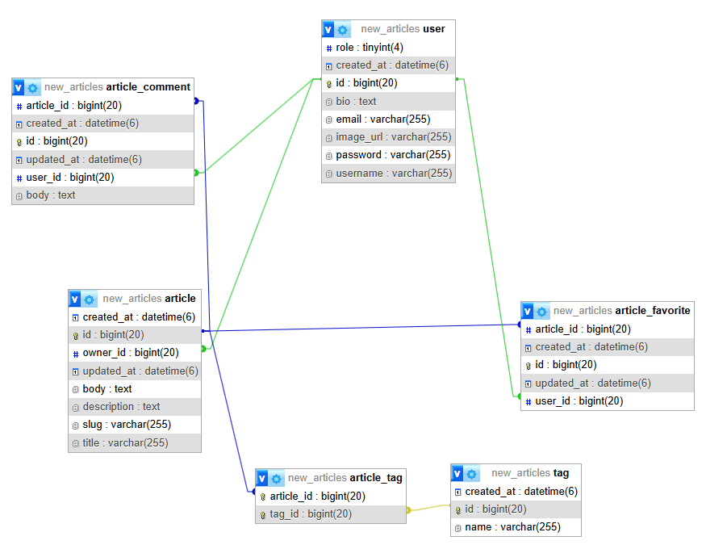

Название
ArticlesApplication

Описание
Данный код представляет собой программу, которая создает базу данных с фейковыми данными
и позволяет работать с этими данными(редактировать, удалять, добавлять новые) с помощью
html-страниц. Сайт имеет несколько типов пользователей - неавторизированные, авторизированные обычные и админы.
Каждый тип пользователя наделен какими-то правами. 

Структура проекта
config/
InsertData - данная директория генерирует фейковые данные в необходимом формате, а после сохраняет в базе данных.
Паралелльно происходит шифрация паролей для безопасности
SecurityConfig - данная директория управляет входом и регистрацией пользователей. Она не дает
неавторизированным пользователям переходить на другие страницы кроме статей, авторизации и регистрации
Здесь также указывается что используется для шифрования паролей

controllers/
ArticleController - связывает ArticleService с пользователем для того чтобы пользователь
мог работать и взаимодействовать со статьями на сайте
LoginController - отображает форму для входа пользователя, когда он посещает страницу login.html
RegistrationController - отображает форму для регистрации пользователя,
сохраняет нового пользователя и перенаправляет на login.html после регистрации
TagController - предоставляет функционал для создания, отображения, редактирования и удаления тегов на сайте
UserController - предоставляет функционал для создания, отображения, редактирования и удаления пользователей на сайте

entities/
Article - создает сущность Article, определяет структуру таблицы в БД, задает связи и так далее
ArticleComment - создает сущность ArticleComment, определяет структуру таблицы в БД, задает связи и так далее
ArticleFavorite - создает сущность ArticleFavorite, определяет структуру таблицы в БД, задает связи и так далее
Author - создает сущность Author, определяет структуру таблицы в БД, задает связи и так далее
Tag - создает сущность Tag, определяет структуру таблицы в БД, задает связи и так далее
User - создает сущность User, определяет структуру таблицы в БД, задает связи и так далее

repositories/
ArticleCommentRepository - интерфейс, который реализует кастомные и готовые методы для работы с БД
ArticleFavoriteRepository - интерфейс, который реализует кастомные и готовые методы для работы с БД
ArticleRepository - интерфейс, который реализует кастомные и готовые методы для работы с БД
AuthorRepository - интерфейс, который реализует кастомные и готовые методы для работы с БД
TagRepository - интерфейс, который реализует кастомные и готовые методы для работы с БД
UserRepository - интерфейс, который реализует кастомные и готовые методы для работы с БД

service/
ArticleService - интерфейс с методами для выполнения операций со статьями
ArticleServiceImpl - реализация интерфейса с конкретной логикой 
AuthorService - интерфейс с методами для выполнения операций со статьями
AuthorServiceImpl - реализация интерфейса с конкретной логикой
CustomUserDetailsService - проверяет существует ли пользователь в базе данных по имени,
преобразует роль пользователя в соответствующие права доступа,
возвращает  UserDetails для использования в процессе аутентификации с Spring Security.
TagService - интерфейс с методами для выполнения операций с тегами
TagServiceImpl - реализация интерфейса с конкретной логикой
UserService - интерфейс с методами для выполнения операций с тегами
UserServiceImpl - реализация интерфейса с конкретной логикой

main class 
ArticlesApplication - запускает приложение

Как запустить проект
Включить xampp, перейти в localhost и создать базу данных
CREATE DATABASE IF NOT EXISTS new_articles
CHARACTER SET utf8mb4
COLLATE utf8mb4_unicode_ci;
-- Создать пользователя
CREATE USER 'new_user'@'localhost' IDENTIFIED BY 'new_password';
-- Предоставить все привилегии на базу данных new_articles пользователю new_user
GRANT ALL PRIVILEGES ON new_articles.* TO 'new_user'@'localhost';
-- Применить изменения
FLUSH PRIVILEGES;

https://github.com/KRAKENN8/ArticlesApplication/tree/test - скачать код, разархивировать, запустить
Открыт login.html, установить верный port Tomcat, зайти на аккаунт любым способом:
1. Зарегестрировать нового юзера
2. Зайти на админ аккаунт, где юзернейм admin, а пароль 123

Функциональность
Есть удаление, добавление и редактирование всего, что необходимо по заданию

Роли пользователей
Неавторизированные пользователи могут только читать статьи, но взаимодействовать иначе - нет
Авторизированные пользователи могут редактировать и удалять свои статьи, создавать новые статьи и теги
Админ имеет право делать все, в том числе удалять пользователей со всеми зависимостями(статьи, комментарии)

База данных (ER-диаграмма)

7. Создайте несколько методов в репозиториях, используя @Query аннотацию. Например, найдите все статьи, опубликованные в определенном месяце.